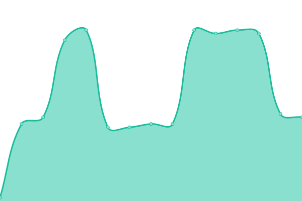

# [📈 Live Status](https://status.io.gt): <!--live status--> **🟧 Partial outage**

This repository contains the open-source uptime monitor and status page for [Upptime](https://upptime.js.org), powered by [Upptime](https://github.com/upptime/upptime).

With [Upptime](https://upptime.js.org), you can get your own unlimited and free uptime monitor and status page, powered entirely by a GitHub repository. We use [Issues](https://github.com/upptime/upptime/issues) as incident reports, [Actions](https://github.com/IOGT/upptime/actions) as uptime monitors, and [Pages](https://status.io.gt) for the status page.

<!--start: status pages-->
<!-- This summary is generated by Upptime (https://github.com/upptime/upptime) -->
<!-- Do not edit this manually, your changes will be overwritten -->
<!-- prettier-ignore -->
| URL | Status | History | Response Time | Uptime |
| --- | ------ | ------- | ------------- | ------ |
|  [IO.GT MAIN SITE](https://io.gt) | 🟩 Up | [io-gt-main-site.yml](https://github.com/IOGT/upptime/commits/HEAD/history/io-gt-main-site.yml) | 

 787ms
     
 | 

<a href="https://status.io.gt/history/io-gt-main-site">87.39%</a>
    

|  [Client Area](https://clientarea.io.gt) | 🟩 Up | [client-area.yml](https://github.com/IOGT/upptime/commits/HEAD/history/client-area.yml) | 

 799ms
     
 | 

<a href="https://status.io.gt/history/client-area">99.87%</a>
    

|  IOGT CLOUD | 🟩 Up | [iogt-cloud.yml](https://github.com/IOGT/upptime/commits/HEAD/history/iogt-cloud.yml) | 

 483ms
     
 | 

<a href="https://status.io.gt/history/iogt-cloud">98.96%</a>
    

|  PBX System 1 | 🟩 Up | [pbx-system-1.yml](https://github.com/IOGT/upptime/commits/HEAD/history/pbx-system-1.yml) | 

 221ms
     
 | 

<a href="https://status.io.gt/history/pbx-system-1">100.00%</a>
    

|  IOGT HOSTING | 🟩 Up | [iogt-hosting.yml](https://github.com/IOGT/upptime/commits/HEAD/history/iogt-hosting.yml) | 

 729ms
     
 | 

<a href="https://status.io.gt/history/iogt-hosting">99.88%</a>
    

|  [IO.GT DNS 1](dns1.io.gt) | 🟩 Up | [io-gt-dns-1.yml](https://github.com/IOGT/upptime/commits/HEAD/history/io-gt-dns-1.yml) | 

 115ms
     
 | 

<a href="https://status.io.gt/history/io-gt-dns-1">100.00%</a>
    

|  [IO.GT DNS 1](dns1.io.gt) | 🟩 Up | [io-gt-dns-1.yml](https://github.com/IOGT/upptime/commits/HEAD/history/io-gt-dns-1.yml) | 

 115ms
     
 | 

<a href="https://status.io.gt/history/io-gt-dns-1">100.00%</a>
    

|  [IO.GT DNS 2](dns2.io.gt) | 🟩 Up | [io-gt-dns-2.yml](https://github.com/IOGT/upptime/commits/HEAD/history/io-gt-dns-2.yml) | 

 115ms
     
 | 

<a href="https://status.io.gt/history/io-gt-dns-2">100.00%</a>
    

|  [IO.GT DNS 3](dns3.io.gt) | 🟩 Up | [io-gt-dns-3.yml](https://github.com/IOGT/upptime/commits/HEAD/history/io-gt-dns-3.yml) | 

 108ms
     
 | 

<a href="https://status.io.gt/history/io-gt-dns-3">100.00%</a>
    

|  [IO.GT DNS 4](dns4.io.gt) | 🟩 Up | [io-gt-dns-4.yml](https://github.com/IOGT/upptime/commits/HEAD/history/io-gt-dns-4.yml) | 

 108ms
     
 | 

<a href="https://status.io.gt/history/io-gt-dns-4">100.00%</a>
    

|  Speedtest server | 🟥 Down | [speedtest-server.yml](https://github.com/IOGT/upptime/commits/HEAD/history/speedtest-server.yml) | 

 0ms
     
 | 

<a href="https://status.io.gt/history/speedtest-server">0.14%</a>
    

|  WHA.GT API | 🟩 Up | [wha-gt-api.yml](https://github.com/IOGT/upptime/commits/HEAD/history/wha-gt-api.yml) | 

 273ms
     
 | 

<a href="https://status.io.gt/history/wha-gt-api">99.82%</a>
    

<!--end: status pages-->

[**Visit our status website →**](https://status.io.gt)

## 📄 License

- Powered by: [Upptime](https://github.com/upptime/upptime)
- Code: [MIT](./LICENSE) © [Upptime](https://upptime.js.org)
- Data in the `./history` directory: [Open Database License](https://opendatacommons.org/licenses/odbl/1-0/)
